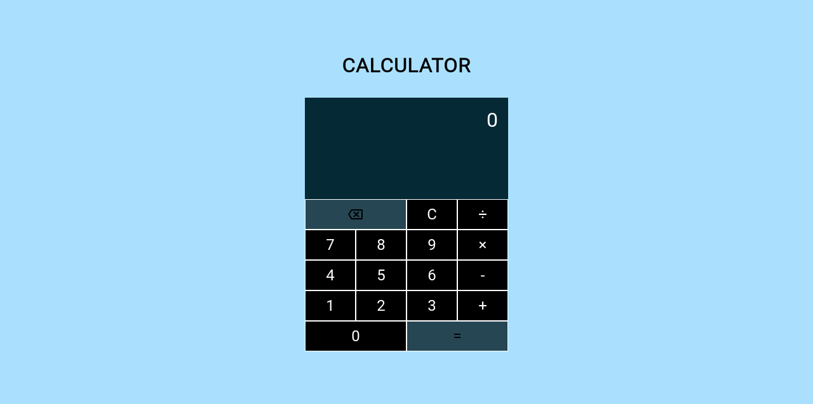

# Calculator

Built with HTML, CSS and JS, interface done with a mix of grid for the keys and flex box for the display.
In the javascript Regular Expressions were used a lot as it was a new subject that I wanted to learn more about.

